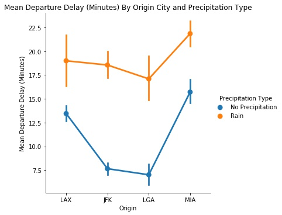

# Flight Delays in Four Major Airports in Three Major Cities

## Research Question

How does rain affect departure delay time in July and December, heavy travel months, from 2013 to 2018 in four major airports (John F. Kennedy, La Guardia, Miami, and Los Angeles) in New York, NY, Miami, FL, and Los Angeles, CA?

## Data
* [DarkSky API](https://darksky.net/dev)
    * Time period: July, December 2013-2018
    * Daily weather data for Los Angeles, CA, Miami, FL, and New York, NY
    * 930 data points
* [Bureau of Transportation Statistics](https://transtats.bts.gov/DL_SelectFields.asp?Table_ID=236&DB_Short_Name=On-Time)
    * Time period: July, December 2013-2018
    * Flight data for all flights between Los Angeles, CA, Miami, FL, and New York, NY
    * 50,000+ data points

```python
import mysql.connector
from mysql.connector import errorcode
import config

# Connect to MySQL database
dbname = 'FLIGHTS'
cnx = mysql.connector .connect(
    host = config.host,
    user = config.user,
    passwd = config.password,
    db = dbname
)
cursor = cnx.cursor()

# Get FLIGHTS data from MySQL
cursor.execute('''SELECT flight_id, date, origin, origin_city, dest, dest_city, dep_delay, arr_delay FROM FLIGHTS.FLIGHTS''')
flights_data = cursor.fetchall()
flights_df = pd.DataFrame(flights_data)

# Format dataframe
field_names = [i[0] for i in cursor.description]
flights_df.columns = field_names
flights_df.dropna(inplace = True)

flights_df.head()
```

```python
# Get WEATHER data from MySQL
cursor.execute('''SELECT date, city_name, precip_intens, precip_type, max_temp, min_temp, visibility, wind_gust FROM FLIGHTS.WEATHER''')
weather_data = cursor.fetchall()
weather_df = pd.DataFrame(weather_data)

# Close connection
cursor.close()
cnx.close()

# Format dataframe
weather_df.shape
field_names = [i[0] for i in cursor.description]
weather_df.columns = field_names

weather_df.head()
```

```python
Merge flight and weather data
flight_weather = pd.merge(flights_df, weather_df,  how = 'left', left_on=['date','origin_city'], right_on = ['date','city_name'])
# Fill missing values with 'No Precipitation'
flight_weather_precip = flight_weather.fillna(value = {'precip_type': 'No Precipitation'})

flight_weather_precip.head()
```

```python
flight_weather_twoway = flight_weather_precip[flight_weather_precip['precip_type'].isin(['No Precipitation', 'rain'])]
```

## Variables of Interest
* Weather Data
    * **precip_type:** precipitation type (no precipitation, rain, sleet, or snow)
        * for our purposes, we only looked at no precipitation and rain conditions

```python
# Calculate standard deviation of departure delay by origin city
count_precip = pd.DataFrame(flight_weather_precip.groupby('precip_type').size())
count_precip['dep_delay'] = pd.DataFrame(flight_weather_precip.groupby('precip_type')['dep_delay'].std())
count_precip.columns = ['# of Flights Affected by Precipitation Type', 'Standard Deviation of Departure Delay (Minutes)']
count_precip
```

* Flights Data
    * **origin:** airport from which flight is departing
    * **dep_delay:** departure delay time in minutes

```python
# Calculate standard deviation of departure delay by origin city
count_airport = pd.DataFrame(flights_df.groupby('origin').size())
count_airport['dep_delay'] = pd.DataFrame(flights_df.groupby('origin')['dep_delay'].std())
count_airport.columns = ['# of Flights', 'Standard Deviation of Departure Delay (Minutes)']
count_airport
```



From this figure, we can see that mean departure delay time is greater when it is raining for every origin airport. But the difference in mean departure delay time between the rain vs. no precipitation conditions is greater for JFK and LGA.

## Statistical Tests
### Two-sided t-test

Here we can see that it only snowed or sleeted in New York. As a result, we only looked at flights that left on days with no precipitation or when it was raining. To examine the differences in departure delay time, we ran a two-sided, two-sample t-test to look at departure delay time (minutes).

`H_0:` There is no difference in departure delay time between flights not affected by any precipitation and flights that were affected by rain. (`D_{\text{no rain}}` = `D_{\text{rain}`)
`H_a:` We can reject the null hypothesis. There is a difference in departure delay time between flights not affected by any precipitation and flights that were affected by rain. (`D_{\text{no rain}} \neq D_{\text{rain}`)

```python
# Subset for rain or no precipitation
rain = flight_weather_twoway[flight_weather_twoway['precip_type'] == 'rain']
no_rain = flight_weather_twoway[flight_weather_twoway['precip_type'] == 'No Precipitation']

# Print mean departure delay (minutes) for when it's raining and not raining
# Print degrees of freedom
rain_mu = np.mean(rain['dep_delay'])
no_rain_mu = np.mean(no_rain['dep_delay'])
df = len(rain['dep_delay']) + len(no_rain['dep_delay']) - 2

# Get t-test and p-value
t, p = ttest_ind(rain['dep_delay'], no_rain['dep_delay'], equal_var = False)

# Format results of t-test into dataframe
ttest = pd.DataFrame([[round(rain_mu, 4), round(no_rain_mu, 4), round(rain_mu, 4) - round(no_rain_mu, 4), df, round(t, 4), p]], )
ttest.columns = ['Mean Dep. Delay (Rain)', 'Mean Dep. Delay (No Precip.)', 'Mean Diff.', 'Degrees of Freedom', 't-statistic', 'p-value']
ttest
```

